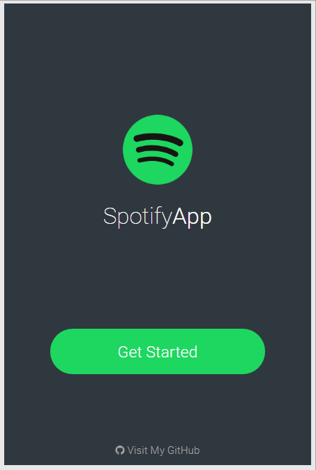

# Spotify App

####Spotify Mobile App with ReactJS & Spotify API



## Config

Some of the API calls made require an OAuth Token that you can get [here](https://developer.spotify.com/web-api/console/get-artist/) clicking in the *Get OAuth Token* button. This token has a limited time (since the app was made for learning purposes only i didn't search for a workaround)<br><br>
With the token provided paste it in *src/js/utils/AppAPI.js at line 3* and you're good to go.

## Install

```sh
$ npm install
```

## Usage

```sh
$ gulp
```

```sh
run dist/index.html
```
